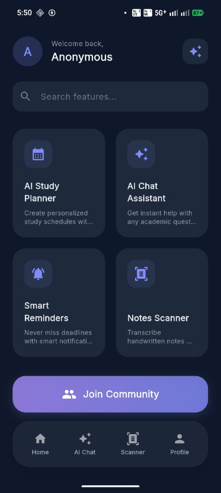
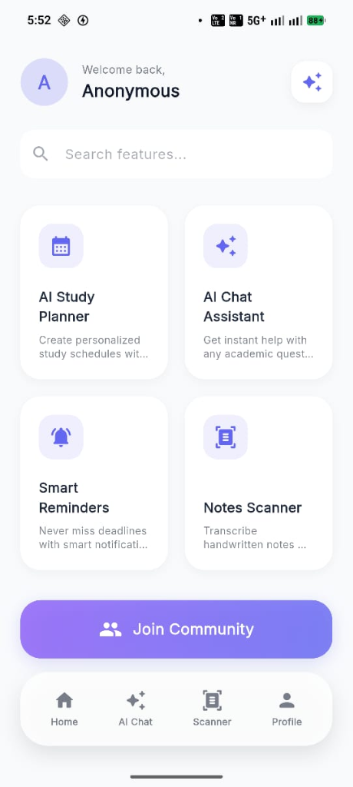
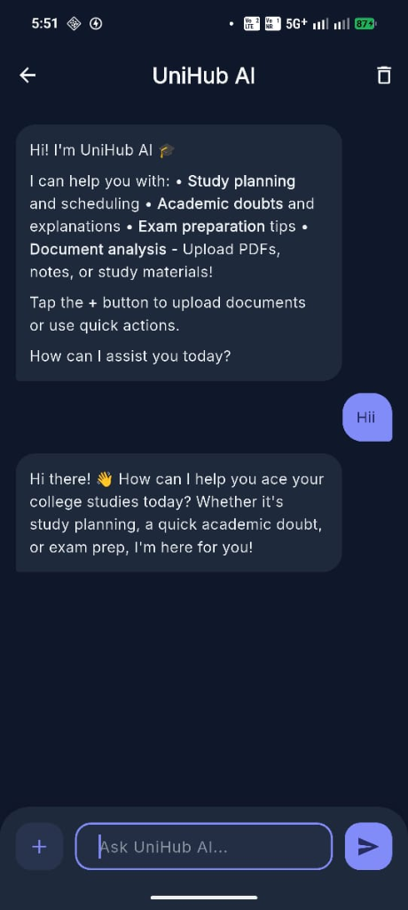
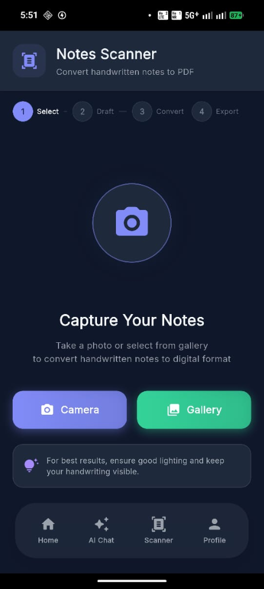
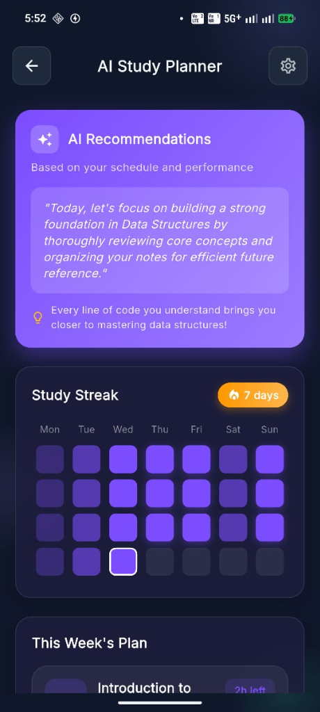
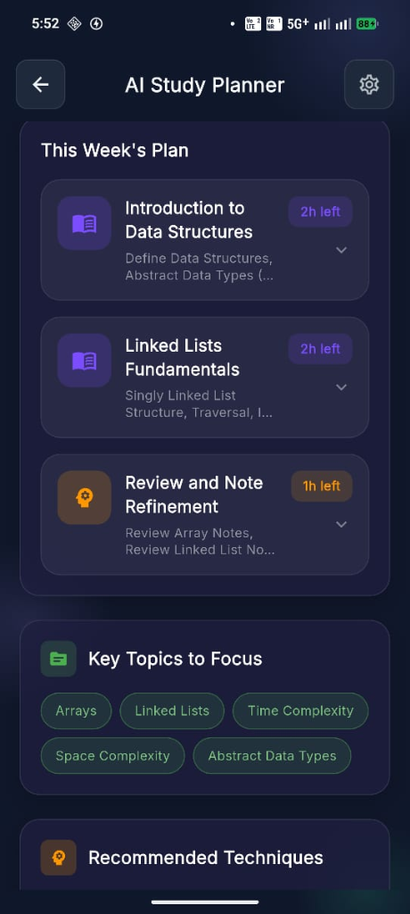

<div align="center">
  
  <h1>🎓 UniHub</h1>
  <p><b>Your AI-Powered Smart Campus Companion</b></p>
  
  <p>
    
    
    
    
  </p>

  <p align="center">
    
    
    
  </p>
</div>

> ⭐ If UniHub looks useful to you, consider starring the repo — it helps other students find it too!

UniHub is an AI-powered study assistant application built with Flutter. It combines task management, study planning, and AI assistance into a single, beautifully designed campus companion app.

---

## 📸 Screenshots

<div align="center" style="display: flex; gap: 10px; flex-wrap: wrap; justify-content: center;">
  
  
  
   
   
   
  
</div>

---

## ✨ Features

### ✅ Fully Functional
- **Authentication**: Secure login via Email/Password and Google Sign-In (Firebase Auth).
- **AI Chat Assistant**: Integration with advanced AI models via **OpenRouter** for educational Q&A. Supports text, images, and uploading PDF documents for context-aware answers.
- **Study Planner**: Generates personalized weekly study schedules based on user topics and hours.
- **Notes Scanner**: Uses vision capabilities to scan handwritten notes, transcribe them, and generate summaries, flashcards, and quizzes. Export results to PDF.
- **Profile Management**: Account management, security settings, notification toggles, and seamless Dark/Light mode theme switching.

### 🚧 Prototype / UI-Only
- **Smart Reminders**: Specialized content-aware reminders system UI.
- **Community Feed**: A beautiful space for students to share resources and updates.

---

## 🛠️ Tech Stack

- **Framework**: Flutter (Material Design 3 with dynamic `ColorScheme` & `flutter_animate` transitions)
- **Backend & Auth**: Firebase Authentication & Firestore
- **AI Integration**: Custom REST Client utilizing the OpenRouter API (defaults to `google/gemini-2.5-flash`)
- **Navigation**: `go_router` (declarative routing with auth guards)
- **State Management**: `provider` (lightweight `ChangeNotifier` architecture)
- **PDF & File Handling**:
  - `syncfusion_flutter_pdf` for extracting text from uploaded PDFs
  - `pdf` & `printing` for generating downloadable study guides
  - `file_picker` & `image_picker` for local media selection

---

## 📂 Architecture

The `lib/` directory is organized using a strict **feature-first architecture**:

```text
lib/
├── config/          # Application-wide settings and API configuration
├── core/            # Shared infrastructure (AI client, theme, router)
├── features/        # Self-contained feature modules
│   ├── auth/        # Firebase Auth + Google Sign-In
│   ├── chat/        # AI Chat Assistant
│   ├── study_planner/ # AI Study Plan generator
│   ├── notes_scanner/ # Handwriting transcription & PDF export
│   ├── reminders/   # Smart Notifications
│   ├── community/   # Community Feed
│   ├── home/        # Home screen and navigation hub
│   └── profile/     # User profile & settings
├── widgets/         # App-level shared widgets
└── main.dart        # Entry point
```

---

## 🚀 Setup & Configuration

### Prerequisites
- Flutter SDK ≥ 3.0.0
- Firebase Project with Auth and Firestore enabled
- An [OpenRouter API key](https://openrouter.ai/)

### Developer Setup Checklist

1. **Clone and install dependencies**:
   ```bash
   git clone https://github.com/your-org/UniHub.git
   cd UniHub
   flutter pub get
   ```

2. **Firebase Configuration**:
   - Place `android/app/google-services.json` (Android) in your local environment.
   - Place `ios/Runner/GoogleService-Info.plist` (iOS) in your local environment.

3. **OpenRouter API Key**: 
   Provide your API key at runtime (never commit it to version control).
   ```bash
   flutter run --dart-define=OPENROUTER_API_KEY="sk-or-v1-..."
   ```

### Running the App

**Debug Mode:**
```bash
flutter run --dart-define=OPENROUTER_API_KEY="your_api_key_here"
```

**Release Build:**
```bash
flutter build apk --release --dart-define=OPENROUTER_API_KEY="your_api_key_here"
```

> **Note on Security**: API keys are injected at build time. Debug logs are stripped in release mode, and Android backups are disabled to prevent local data leakage.

---

## ⚠️ Known Limitations

- **Offline Mode**: Currently, the app requires an active internet connection to communicate with Firebase and OpenRouter.
- **Community Feed & Reminders**: These sections are highly-polished UI prototypes. Backend integration and physical notification scheduling are planned for future updates.

---

## 🤝 Contributing

1. Fork the repository and create a feature branch from `main`.
2. Follow the existing feature-first directory structure.
3. Ensure `flutter analyze` produces zero warnings before opening a PR.
4. Run `dart format .` before committing.

## 🔄 Continuous Integration
A standard CI pipeline runs on every push:
```bash
flutter pub get
dart format --set-exit-if-changed .
flutter analyze --no-fatal-infos
```
