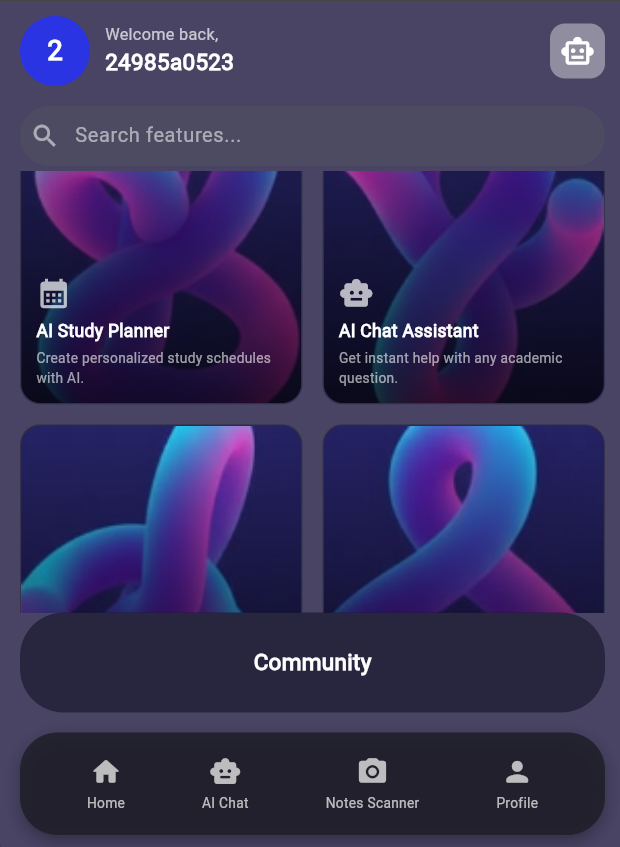
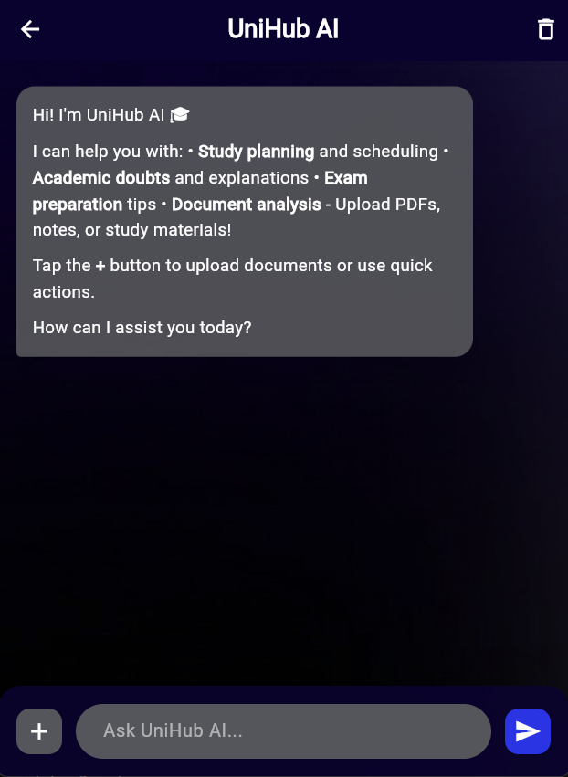
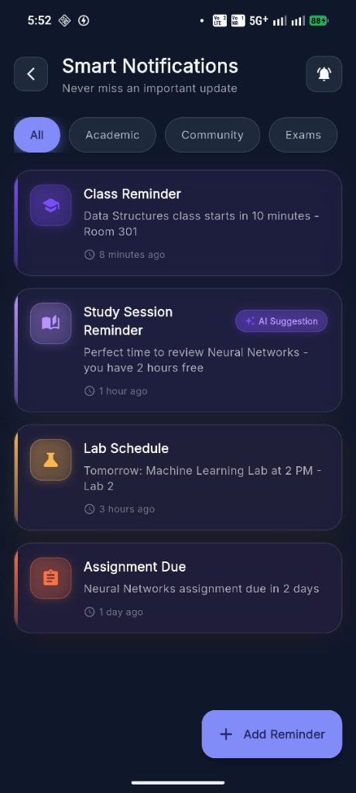

# UniHub

UniHub is an AI-powered study assistant application built with Flutter. It combines task management, study planning, and AI assistance into a single campus companion app.

## Screenshots

<div style="display: flex; gap: 10px;">
  
   
  
   
</div>

## Features

### ✅ Fully Functional
- **Authentication**: Secure login via Email/Password and Google Sign-In (Firebase Auth).
- **AI Chat Assistant**: Integration with Gemini AI for educational Q&A. Supports text, images, and uploading PDF documents for context-aware answers.
- **Study Planner**: Generates personalized weekly study schedules using AI based on user topics and hours.
- **Notes Scanner**: Uses vision capabilities to scan handwritten notes, transcribe them, and generate summaries, flashcards, and quizzes. Can export results to PDF.
- **Profile Management**: User details and convenient account management.

### 🚧 Prototype / UI-Only
- **Smart Reminders**: Specialized content-aware reminders system (UI implemented).
- **Community Feed**: A space for students to share resources and updates (UI implemented).

## Tech Stack

- **Flutter**: Dart-based cross-platform framework (Material Design 3).
- **Firebase**:
  - Auth: User identity management.
  - Firestore: Cloud database for storing user profiles and study data.
- **AI & ML**: Google Gemini (`google_generative_ai`) for generative text and vision tasks.
- **Navigation**: `go_router` — declarative routing with auth guards and named routes.
- **State Management**: `provider` — lightweight `ChangeNotifier`-based auth state.
- **PDF & File Handling**:
  - `syncfusion_flutter_pdf`: For extracting text from uploaded PDFs.
  - `pdf` & `printing`: For generating downloadable study guides.
  - `file_picker` & `image_picker`: For local media selection.
- **Markdown**: `flutter_markdown` for rendering rich AI responses.

## Architecture

The `lib/` directory is organized using a **feature-first architecture**:
- `config/`: Application-wide settings and API key configuration.
- `core/`: Shared infrastructure — `services/` (AI client), `theme/` (colors, theme), `prompts/` (AI prompt templates), `utils/` (shared utilities), `routing/` (navigation).
- `features/`: Each feature is a self-contained module with its own `models/`, `repositories/`, `services/`, `screens/`, and `widgets/` sub-directories.
  - `auth/` — Firebase Auth + Google Sign-In
  - `chat/` — AI Chat Assistant
  - `study_planner/` — AI Study Plan generator
  - `notes_scanner/` — Handwriting transcription & PDF export
  - `reminders/` — Smart Notifications (UI prototype)
  - `community/` — Community Feed (UI prototype)
  - `home/` — Home screen and navigation hub
  - `profile/` — User profile management
- `widgets/`: App-level shared widgets (e.g., bottom navigation bar).
- `main.dart`: Application entry point, Firebase initialization, and routing.

## Setup & Configuration

### Prerequisites
- Flutter SDK ≥ 3.0.0
- Firebase Project with Auth and Firestore enabled
- A [Google Gemini API key](https://aistudio.google.com/app/apikey)

### Developer Setup Checklist

1. **Clone and install dependencies**:
   ```bash
   git clone https://github.com/your-org/UniHub.git
   cd UniHub
   flutter pub get
   ```

2. **Firebase Configuration**:
   - Place `android/app/google-services.json` (Android) in your local environment.
   - Place `ios/Runner/GoogleService-Info.plist` (iOS) in your local environment.
   - Add your debug SHA-1 fingerprint to the Firebase Console:
     ```bash
     keytool -list -v -keystore ~/.android/debug.keystore \
       -alias androiddebugkey -storepass android -keypass android
     ```

3. **Keystore (Release Builds only)**:
   - Copy `android/keystore.properties.example` to `android/keystore.properties`.
   - Fill in your signing key details.

4. **Gemini API Key**: Set it at runtime — never commit it.
   ```bash
   flutter run --dart-define=GEMINI_API_KEY="your_actual_api_key_here"
   ```
   > Without the key, AI features show an `ApiKeyMissingBanner` instead of crashing.

### Running the App

**Debug Mode:**
```bash
flutter run --dart-define=GEMINI_API_KEY="your_actual_api_key_here"
```

**Release Build:**
```bash
flutter build apk --release --dart-define=GEMINI_API_KEY="your_actual_api_key_here"
```

### Note on Security
- API keys are never hardcoded in the source — they are injected at build time.
- Debug logs are stripped in release mode.
- Android backups are disabled to prevent data leakage.

## Known Limitations
To provide transparency regarding the current state of the application:
- **Offline Mode**: Currently, the app requires an active internet connection.
- **Community Feed & Reminders**: These sections are functional as UI prototypes. Backend integration and notification scheduling are planned for future updates.
- **Data Sync**: While Firebase stores user data, real-time cross-device synchronization might experience slight delays during complex AI operations.

## Contributing

1. Fork the repository and create a feature branch from `main`.
2. Follow the existing feature-first directory structure.
3. Ensure `flutter analyze` produces zero warnings before opening a PR.
4. Run `dart format .` before committing.
5. Write tests for any new business logic in `lib/core/` or `lib/features/*/services/`.

## Continuous Integration
A GitHub Actions CI pipeline runs on every push and PR:
```bash
flutter pub get
dart format --set-exit-if-changed .
flutter analyze --no-fatal-infos
flutter test --coverage
```
